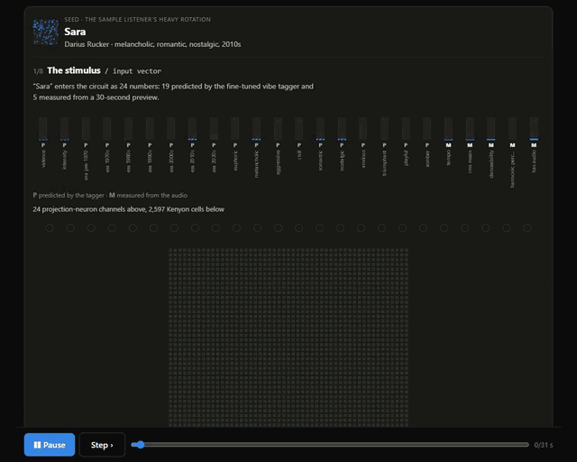
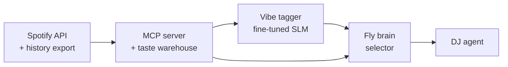

# Selector

**A personal taste engine built from my own streaming-history export, and the DJ is a fly.**

[](https://selector-demo.vercel.app/watch)

**[Watch the fly pick the next track →](https://selector-demo.vercel.app/watch)** · **[Try it on your own Spotify export →](https://selector-demo.vercel.app)** · [60-second demo video](docs/media/selector-demo.mp4)

Nothing to install. The demo parses your export in the browser tab and uploads nothing.

Selector is an independent, non-commercial personal project. It is not affiliated with or endorsed by Spotify.

## The constraint

In November 2024 Spotify cut most of its recommendation surface from the Web API for newly created apps. Almost every music-recommendation tutorial online stopped working overnight.

| Status | Endpoints |
| --- | --- |
| Gone for new apps | Audio features, audio analysis, recommendations, related artists, 30-second preview URLs |
| Still available | Search, user library, top artists and tracks, playlist create and edit, playback control |
| Still available, off-API | Extended Streaming History, via the GDPR data export |

So the project works within what's left: the data export I own, plus audio from elsewhere. I wanted to derive the features myself, which means deciding which ones can be measured from audio (tempo, loudness, danceability), which have to be predicted by a model (valence, mood, era), and how to grade the model honestly.

Measuring anything needs audio, and Spotify's 30-second preview URLs went with the rest. So the audio comes from two public, keyless catalog APIs instead: the iTunes Search API first, and Deezer's public API as a fallback. No scraping and no YouTube. Across the full 19,386-track library, 16,741 matched (86.4%), falling from 93.6% on the most-played decile to 85.4% on the least. The matcher rejects rather than guesses, and it still let one wrong match through ("505" by Arctic Monkeys → a techno bootleg). [The full match report](docs/AUDIO_MATCHING.md) lists it, along with the point where Apple's API started returning 403s mid-run and Deezer carried the rest.

Every audio feature here comes from a 30-second excerpt, not the full track. Tempo, loudness and spectral descriptors are sound on a clip. Song structure and arrangement are not, and nothing in this project claims them.

## Four layers



1. **MCP server and taste warehouse.** The streaming-history export (46,202 plays, 19,386 tracks, 2022 to 2026) is ingested into DuckDB with `ip_addr` dropped. It's exposed to Claude as 20 MCP tools: warehouse questions ("what did I binge in March and then abandon?"), the surviving live Spotify endpoints over PKCE OAuth, and the fly and DJ tools below. `src/selector/{ingest,warehouse,mcp,spotify}`
2. **Vibe tagger.** Measured features come from librosa (native on Windows) and Essentia's pretrained models (in WSL2). Predicted features come from Qwen3-0.6B with a LoRA fine-tune, distilled from `claude-sonnet-5` labels on 3,492 tracks and then run over all 19,386 on a consumer AMD GPU through llama.cpp's Vulkan backend. `src/selector/{audio,tagger}`
3. **The fly.** Dasgupta, Stevens & Navlakha (*Science*, 2017) showed that the fruit fly's olfactory circuit is a locality-sensitive hash. Projection neurons fan out to Kenyon cells, and inhibition leaves about 5% of them firing. Selector runs that algorithm on each track's 24 features, wired from the real FlyWire connectome: 344 projection neurons, 2,597 Kenyon cells, 12,398 weighted connections. The circuit's learning half, dopamine-gated depression of Kenyon-cell to output-neuron synapses, is trained on the history, with a skip as punishment and a play-out as reward. `src/selector/fly`
4. **DJ agent.** Brief → Arc → Select → Critique → Commit, as separate modules. The energy arc is a hard constraint checked against *measured* audio. Select uses fly similarity for coherence and the learned synapses for taste. A critique pass can reject the set and send it back once, and nothing reaches Spotify until critique passes. `src/selector/dj`, [write-up](docs/DJ_AGENT.md)

The public demo ports layers 3 and 4 to TypeScript and runs them client-side over 2.5 MB of static assets, so there is no inference backend. It retrains the mushroom body on each visitor's own plays. It serves no audio, only derived numbers. `web/`

I hope I haven't lost you in layer 3, and in all honesty I had no clue what any of that meant a few weeks ago.. I'm not a biologist. Stripped of the neuron talk, it's this: **the fly takes an input vector (a song's tempo, danceability, mood tags, ...) and maps it to a sparse output vector, and songs whose output vectors land close together sound alike.** It's a way to turn a song into a fingerprint, using a real biological mechanism. That's exactly what any locality-sensitive hash does. The part that isn't generic is *how* the mapping is wired: it's not learned and it's not a random matrix, it's the fly's actual projection-neuron-to-Kenyon-cell connectivity, pulled from a real connectome. No training is needed to get a useful hash out of it, only to get *taste* out of it, and that's what the plasticity rule on top, trained on skips and replays, is for.

## Results

| Result | Headline | Details |
| --- | --- | --- |
| Vibe tagger eval, three arms | Lyrics + audio + metadata beats lyrics + metadata by 22% on intensity error (0.094 → 0.073) and 9% on valence. Audio alone barely beats the floor on valence. The untuned model scores below a train-mean baseline everywhere, so fine-tuning is what makes it work. | [docs/EVAL.md](docs/EVAL.md) |
| Audio match rate | 86.4% of the full 19,386-track library, 90.6% of an early 500-track long-tail sample, reject-over-guess at a 0.72 threshold. | [docs/AUDIO_MATCHING.md](docs/AUDIO_MATCHING.md) |
| Fly vs classical LSH | On MNIST at 4 bits, FlyHash reaches 0.086 mAP against 0.017 for random-projection LSH, reproducing the paper. The real FlyWire wiring ties the idealised circuit at 4 bits but falls behind it from 8 bits on, and behind classical LSH by 64. | [docs/FLYWIRE.md](docs/FLYWIRE.md) |
| Skip prediction, mushroom body | Trained on 2022–24, tested on 2025–26. On tracks never heard before, the fly scores 0.562 to 0.571 ROC-AUC against 0.509 for per-track history. Modest, reported as measured; text-only features edge out audio + text, though expanding audio coverage from 16.5% to 86% narrowed that gap from 0.038 to 0.009. | [docs/MBON_EVAL.md](docs/MBON_EVAL.md) |

**[Watch the fly DJ visualiser →](https://selector-demo.vercel.app/watch)** Every dot on that page is computed in your browser from the real projection, the real fingerprints and a mushroom body trained in the tab. Press *skip it* and the plasticity rule runs live. The synapses from that track's active Kenyon cells visibly weaken, and the same query picks a different song.

### Limits worth knowing

- **Fingerprints still collide, much less than before.** Expanding audio coverage from the top 3,000 tracks to the whole library dropped the share of tracks sharing an exact fingerprint from 81.7% to 40.4%. It's now 32.5% even among tracks with audio (up from 5.4% at the old, smaller scale — more tracks means more chances to land in the same coarse bucket) and 90.6% among the 13.7% still without it. "More like this" on an audio-less seed still often returns ties at Hamming distance 0.
- **One of the four measured audio inputs is nearly dead weight.** `harmonic_percussive_ratio_scaled` sits below 0.01 for 99% of tracks (median 0.0005), against danceability's much wider spread. A few extreme outliers are squashing everyone else's real variation near zero in the min-max scaling. Not yet fixed.
- **A third of the library has no lyrics on lrclib, and most of those aren't instrumentals.** Of 7,101 lyric-less tracks, lrclib confirms 1,168 as instrumental. The other 5,103 are simply unknown to it, and the tagger, which sees `Lyrics: not available` for both, tends to describe them all as instrumentals. `track_features.parquet` records which is which (`lyrics_status`). Feeding that status to the fly as two extra inputs was tried and reverted, because it cost 0.05 AUC on unseen tracks ([details](docs/MBON_EVAL.md)). An earlier fetch bug had cached failed requests as "no lyrics". Fixing it recovered lyrics for 830 tracks ([docs/LYRICS.md](docs/LYRICS.md)).
- **Audio covers 86.4% of the library** (16,741 tracks) after an expansion beyond the original top-3,000 scope. The tagger falls back to its lyrics-only arm for the remaining 13.6%, and every row records which arm produced it.
- **Tempo has octave errors** on about 2 to 4% of clips, the beat tracker's usual half- and double-time confusion. The DJ folds octaves before comparing tempos.
- The eval rows are point estimates from one artist-disjoint test split, with no significance test yet.

## Try it

**In the browser:** [selector-demo.vercel.app](https://selector-demo.vercel.app). Click *Try it with a sample listener* for a synthetic export (invented plays and timestamps over real catalog tracks), or drop your own `my_spotify_data.zip`. To get yours: spotify.com → Account → Privacy settings → Download your data → tick **Extended streaming history**, then confirm the email Spotify sends. It can take up to 30 days.

**As an MCP server**, with Python 3.12 and [uv](https://docs.astral.sh/uv/):

```bash
git clone https://github.com/jeremylach2/selector && cd selector
uv sync
cp .env.example .env            # optional: SPOTIFY_CLIENT_ID for the live tools

# build the warehouse from your export (or try web/public/sample/sample_spotify_data.zip)
uv run python -m selector.ingest.load_history --zip-path my_spotify_data.zip
uv run python -m selector.warehouse.build

claude mcp add selector -- uv --directory "$PWD" run selector-mcp
```

Then ask Claude Code something like *"what did I binge in March and then abandon?"* [docs/INSTALL_MCP.md](docs/INSTALL_MCP.md) covers Claude Desktop and the tool list. [docs/DEPLOY_MCP.md](docs/DEPLOY_MCP.md) covers the hosted HTTP variant. The warehouse tools need only the export. The live Spotify tools need a dev app ([docs/OAUTH_NOTES.md](docs/OAUTH_NOTES.md)). The fly and DJ tools need the tagger outputs, which take the full audio, labelling and fine-tuning pipeline to rebuild. The docs for each step give the exact commands.

**Tests:** `uv run pytest` (182 tests, no personal data needed) and `uv run ruff check .`. CI runs both, plus a guard (`scripts/check_personal_data.py`) that fails the build if an export file, audio, a token or an `ip_addr` value is ever committed.

## Motivations and AI usage throughout this project

In September 2026 there was a burst of "fly brain doing X" videos on YouTube, among them [*I Put a Fly's Conscious Brain into Minecraft*](https://youtu.be/BUkLWjcoBc0) and [*I Uploaded A Fruit Fly Brain To Reply To My Emails*](https://youtu.be/GmCbzlb091A). Sadly, the claims of these videos are largely sensational, so take the framing of those titles with some skepticism. What's public is a connectome, not a trained agent, and neither video's claim is something this project relies on or endorses. What they did give me was the idea.. the FlyWire connectome is real, public, and citable, and the actual, defensible result in the 2017 *Science* paper (olfactory circuit as locality-sensitive hash) was sitting right there, unused for anything like this.

Before AI, building on that idea would have meant committing to a 6-12 month project I wouldn't have had the time for. AI condensed that to the few weekends of agent time laid out in the [Project Plan](Selector%20—%20Project%20Plan.md).

This project was built with Claude Code doing most of the typing, on my own direction. I set the architecture (the four-layer split, the measured-vs-predicted schema, using the FlyWire connectome instead of a random projection), reviewed every component, and made the calls on what to keep, cut, or redo. The reverted lyrics-status feature above is one of several dead ends caught that way. Claude Sonnet 5 also generated the 3,492 distillation labels the vibe tagger's LoRA fine-tune trains on, which makes it part of the ML pipeline itself, not just the tooling around it.

None of this would have shipped solo in the time it took. I'd worked with recommendation systems before but never fine-tuned a model, never touched a connectome dataset, and don't own a GPU built for training. AI collapsed the distance between "I understand the fly-brain paper" and "I have a wired-up, evaluated implementation of it" down to a few weekends. What it didn't do is choose what was worth building, decide when a result was honest enough to report, or catch that a fly-brain fingerprint collision was a real limitation rather than noise to paper over.

### The workflow

I'm a software engineer by day and have experimented with AI-assisted coding a lot. The AI workflow that I employed for a project this size:

1. Write the [Project Plan](Selector%20—%20Project%20Plan.md) myself, in my own words, then go back and forth with an Opus class model until it held up: right scope, real risks named, no overclaiming.
2. Once the plan was solid, have that model turn it into [`PROMPT-PACK.md`](PROMPT-PACK.md): one concrete, scoped prompt per session.
3. With that much planning and context already on paper, a faster, cheaper model could do most of the actual coding. Each session started the same way: "Read the project plan and prompt N from the prompt pack, and complete it."
4. Review every diff and doc by hand before moving on.

The expensive model's job was judgment.. scoping, sequencing, catching risks before they became architecture. The cheap model's job was execution against a spec that judgment had already produced. Skipping steps 1 and 2 and just prompting a cheap model session by session is how these projects sprawl.

A biologist's connectome, a paper from 2017, and a few weekends of evenings were all it took to turn "someone else's neuroscience" into a working piece of my own software, that gap is the smallest it has ever been, and it is only getting smaller. It's a builder and dreamers world now.. if you've had an idea sitting on a shelf because you figured you didn't have the years for it, that's worth a second look.

## Citations and attribution

- Dasgupta, S., Stevens, C. F., & Navlakha, S. (2017). A neural algorithm for a fundamental computing problem. *Science*, 358(6364), 793–796. [doi:10.1126/science.aam9868](https://doi.org/10.1126/science.aam9868)
- Dorkenwald, S., Matsliah, A., Sterling, A. R., et al. (2024). Neuronal wiring diagram of an adult brain. *Nature*. [doi:10.1038/s41586-024-07558-y](https://doi.org/10.1038/s41586-024-07558-y)
- Schlegel, P., Yin, Y., Bates, A. S., et al. (2024). Whole-brain annotation and multi-connectome cell typing of *Drosophila*. *Nature*. [doi:10.1038/s41586-024-07686-5](https://doi.org/10.1038/s41586-024-07686-5)
- **FlyWire connectome data**, materialization v783, © FlyWire Consortium / Princeton Neuroscience Institute, used under [CC-BY-4.0](https://creativecommons.org/licenses/by/4.0/). Connectivity from [Zenodo 10.5281/zenodo.10676866](https://zenodo.org/records/10676866), annotations from [flyconnectome/flywire_annotations](https://github.com/flyconnectome/flywire_annotations). Pooled to the tagger's input width, as described in [docs/FLYWIRE.md](docs/FLYWIRE.md).
- **Audio previews:** [iTunes Search API](https://performance-partners.apple.com/search-api) and the [Deezer API](https://developers.deezer.com/api) ([terms](https://developers.deezer.com/termsofuse)). Clips were downloaded for local feature extraction only. None are stored in this repository or served by the demo.
- **Lyrics:** [lrclib.net](https://lrclib.net), used only as model input and never republished ([docs/LYRICS.md](docs/LYRICS.md)).

What this is: the fly's olfactory circuit used as a locality-sensitive hash, per *Science* 2017, wired from the real connectome, plus the mushroom body's plasticity rule trained on skips. A connectome is a wiring diagram, not a trained brain. Nothing here claims a fly brain does general tasks. It is one circuit used as a hash, plus one learning rule.

Not affiliated with or endorsed by Spotify. Non-commercial: no ads, paid tiers or sponsorship, on the site or the MCP server. The public Rewind story at `/rewind` shows an invented listener, never real listening history; see [docs/PRIVACY.md](docs/PRIVACY.md).

MIT licensed. See [LICENSE](LICENSE).
