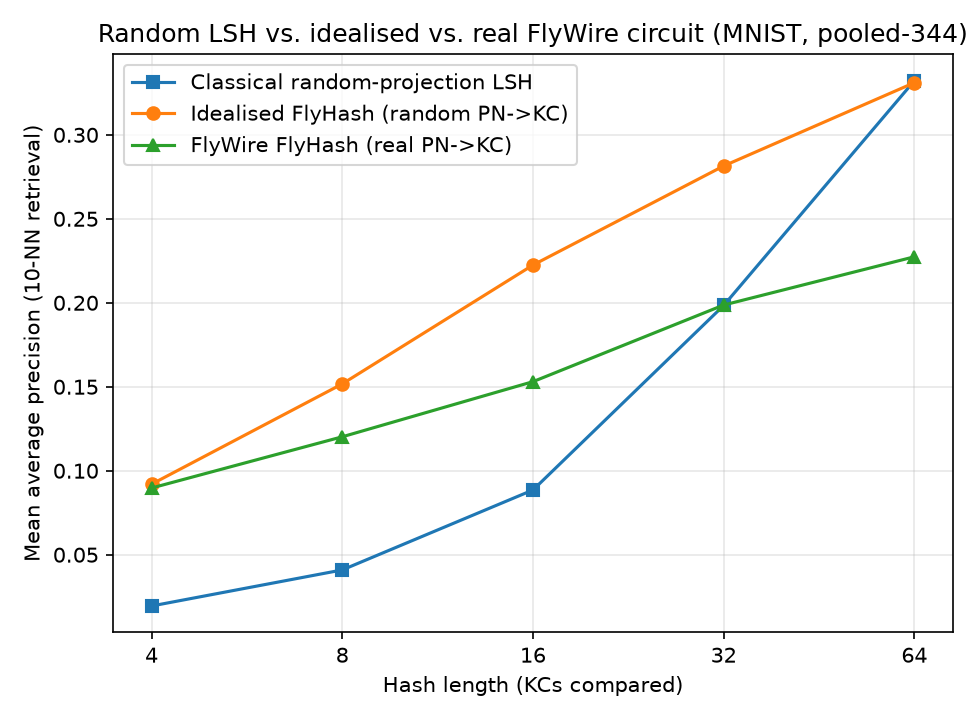

# FlyWire connectome: data source, version, and honest limits

Step 6 of the fly brain replaces `selector.fly.lsh.FlyHash`'s random
projection-neuron -> Kenyon-cell (PN->KC) wiring with the real connectivity
measured in an actual fly brain. This document records exactly which data
that is, where it came from, and where the real circuit differs from the
idealised one in Dasgupta, Stevens & Navlakha's paper.

## What this is, and what it is not

**What it is:** the wiring diagram of the olfactory projection-neuron to
Kenyon-cell pathway in a fully proofread whole-brain Drosophila connectome,
used as a locality-sensitive hash, per Dasgupta, Stevens & Navlakha (Science,
2017).

**What it is not:** a trained brain. A connectome is a static wiring diagram
reconstructed from electron microscopy. It tells us *which* neurons are
synaptically connected and *how many* synapses each connection has. It does
not tell us synaptic weights in a functional sense, and most of what would
determine learned behaviour (synaptic strength changes over an animal's
lifetime) is not part of this dataset. Nothing in this project claims the fly
brain was trained to do anything. The mushroom body's actual learning rule is
implemented separately in Step 7 (`selector.fly.mbon`), trained on this
listening history, not on FlyWire.

## Data source

| | |
|---|---|
| Dataset | FlyWire FAFB connectome, materialization version **783** |
| Consortium | FlyWire / Princeton Neuroscience Institute |
| Annotation table | [`flyconnectome/flywire_annotations`](https://github.com/flyconnectome/flywire_annotations), `supplemental_files/Supplemental_file1_neuron_annotations.tsv`, fetched directly from GitHub (no login) |
| Connectivity table | [Zenodo record 10.5281/zenodo.10676866](https://zenodo.org/records/10676866), `proofread_connections_783.feather` (proofread neuron pairs with aggregated synapse counts per neuropil), fetched directly from Zenodo (no login) |
| License | **CC-BY-4.0** |

Both files are public, unauthenticated downloads, no FlyWire account or CAVE
token was needed, which matters for anyone else trying to reproduce this.
That is a deliberate choice: the FlyWire Codex web app (codex.flywire.ai)
gates its bulk CSV export behind an account, but the same proofread
connectivity table the consortium published for reuse is mirrored on Zenodo
under an open license, so this project downloads from there instead.

`selector.fly.connectome.download_flywire_data()` fetches and caches both
files to `data/flywire/` (gitignored, not personal data, but a ~900 MB
external dataset with no reason to live in git history). Re-running the
download is a no-op once cached.

## How olfactory PNs and Kenyon cells were identified

The annotation table's `cell_class` column labels each of the ~140,000
neurons in the brain. Two labels matter here:

- **`ALPN`** (antennal lobe projection neuron), the real olfactory PN
  population. This includes both **uniglomerular** PNs (one glomerulus each,
  the primary per-odorant-receptor channel, 277 of them) and
  **multiglomerular** PNs (pooling across glomeruli, mostly inhibitory, 400
  of them). Both are genuine anatomical inputs to the mushroom body, so both
  are kept rather than hand-picking only the "purer" uniglomerular subset.
- **`Kenyon_Cell`**, the Kenyon cell population, 5,177 across the whole
  brain.

The circuit runs largely independently in each hemisphere, so
`selector.fly.connectome.load_cell_ids` filters to one `side` at a time
rather than pooling both, pooling would let a PN and a KC that never
actually meet look connected purely because two separate per-hemisphere
circuits got merged into one index space.

## Real numbers vs. the paper's idealised circuit

| | Paper's idealised circuit | FlyWire v783, right hemisphere (measured) |
|---|---|---|
| PNs | 50 | **344** (whole-brain ALPN total 685, split ~evenly per side) |
| Kenyon cells | ~2,000 | **2,597** |
| Mean PN inputs per KC | ~6 | **5.19** |
| KCs with no direct ALPN input | 0 (every KC samples PNs by construction) | **145** |

The real fly has roughly **7x more PNs** than the paper's simplified figure
and a somewhat larger KC population than the idealised 2,000, but the mean
PN-inputs-per-KC comes out remarkably close to the paper's assumed 6 (5.19
measured). The paper's 50/2,000 numbers were always a simplification for
analysis, not a measurement, Drosophila has about 50 antennal lobe
glomeruli, but each glomerulus is served by several PNs (sister cells plus
inhibitory multiglomerular PNs), which is exactly the 50-to-344 gap above.
The 145 KCs with no direct ALPN input in this snapshot most likely sample
from non-olfactory (e.g. visual, thermo/hygrosensory) or not-yet-proofread
inputs rather than being wiring errors, they are kept in the matrix as
all-zero rows rather than dropped, since a KC that never fires for any
olfactory-derived input is itself real information, not noise to clean away.

Reproduce these numbers with `uv run python -m selector.fly.connectome
--hemisphere right`.

## Adapting the real connectome to the tagger's feature width

`FlyHash.projection_matrix` expects shape `(n_kc, d_in)`, but the vibe
tagger's feature vector width (on the order of 15-25 measured/predicted
features) will never equal the real PN count (342 per hemisphere). Two
adaptations were considered:

1. **Tile/pad** the short feature vector up to the real PN count by
   repeating it. Rejected: this silently duplicates feature values across
   PNs with no anatomical basis and makes the adaptation invisible in the
   numbers.
2. **Pool** the real PNs down to the feature width instead
   (`selector.fly.connectome.pool_to_width`): group real PNs into `d_in`
   buckets by `pn_index % d_in`, and sum each Kenyon cell's weighted input
   from the PNs sharing a bucket. Feature dimension `j` is the pooled sum of
   whichever real PNs landed in bucket `j`, not a claim that dimension `j`
   is any specific real neuron, just an honest, documented lossy compression
   of the anatomical PN population onto the tagger's feature width.

Pooling was used: It is lossy in a stated, inspectable way, and it
preserves the real per-KC connectivity structure (which KCs share which real
PNs) instead of inventing a dense random mixing on top of it.

## Does the real wiring actually help retrieval?

`notebooks/fly_connectome_validation.py` re-runs Step 5's benchmark with a
third line: classical random-projection LSH, idealised FlyHash (random
PN->KC wiring), and FlyWire FlyHash (the real wiring above), all at matched
hash lengths on the same pooled-MNIST input.

At 4 bits, real and idealised are statistically tied and both clearly beat classical LSH. From 8 bits onward, real FlyHash falls increasingly behind idealised FlyHash, and by 64 bits it also falls behind classical LSH (.23 vs. .33). It underperforms the plain-random baseline outright. Idealised FlyHash converges with classical LSH at 64 bits. Real FlyHash does not follow that trend and instead plateaus well below both.

Conclusion: the real connectome's wiring, once adapted to the tagger's feature width via pool_to_width, does not just fail to improve on a matched-statistics random circuit, it measurably underperforms one, and the gap widens with hash length. This is a stronger and more specific claim than "no difference," and it should be treated as a live hypothesis to check against on real vibe-tagger features in Step 12, not assumed to be an MNIST-specific artifact.

Why would idealised beat real at all?

This is the interesting part, and it likely comes down to effective independence between input channels, not anything about the biology being "worse."

Idealised FlyHash's input dimensions are, by construction, fully independent. Each of the 50 synthetic PNs is an unrelated random variable, and each KC samples ~6 of them at random. Every added KC (i.e., every added bit as hash length grows) gets a fresh, independent random combination of independent inputs. That's exactly the condition under which random projection hashing works well and scales cleanly with more bits, more bits keeps buying genuinely new information because nothing is redundant.

Real FlyWire PNs are not independent in the same way, and the pooling step compounds it:

The real population includes many sister cells, multiple PNs serving the same glomerulus (same odorant-receptor channel), which are highly correlated with each other, not independent signals.
It also includes multiglomerular PNs that pool across several glomeruli already, so some "channels" are themselves blends of others before pooling even starts.
pool_to_width then groups 344 real PNs into a much smaller number of buckets purely by pn_index % d_in, an arbitrary index-based split, not one that accounts for which PNs are correlated. So a bucket can easily end up dominated by several correlated sister cells while genuinely distinct signal gets merged together elsewhere, or diluted by summation with unrelated PNs in the same bucket.
On top of that, 145 KCs have no direct ALPN input at all (all-zero rows) and are still included in the matrix, every one of those is a "bit" that contributes literally nothing to the hash.

Put together: real FlyHash's nominal input/hash dimensionality is larger, but its effective dimensionality, the number of genuinely independent signals actually feeding the hash, is smaller than the count suggests, because of correlated pooling and dead cells. Idealised FlyHash has no such waste. Every synthetic dimension and every KC is doing real, independent work.

That explains the specific shape of the result, too: at 4 bits, you're barely using any capacity in either case, so the redundancy in the real circuit hasn't had room to hurt yet, both look similar. As hash length grows, idealised keeps extracting real information from its always-independent inputs, while real keeps re-spending bits on correlated or dead signal, so the gap opens up and grows. That's a textbook signature of effective-rank collapse: nominal dimensionality growing while true information content lags behind, and it's directly testable (e.g., compute the effective rank of the real pooled matrix vs. the idealised one, or rerun pooling with correlation-aware bucketing instead of index modulo, and see if the gap shrinks).

## Citations

- Dasgupta, S., Stevens, C. F., & Navlakha, S. (2017). A neural algorithm for
  a fundamental computing problem. *Science*, 358(6364), 793-796.
- Dorkenwald, S., Matsliah, A., Sterling, A. R., et al. (2024). Neuronal
  wiring diagram of an adult brain. *Nature*.
- Schlegel, P., Yin, Y., Bates, A. S., et al. (2024). Whole-brain annotation
  and multi-connectome cell typing quantifies circuit stereotypy in
  *Drosophila*. *Nature*.
- FlyWire Consortium, Princeton Neuroscience Institute. Data released under
  CC-BY-4.0.
