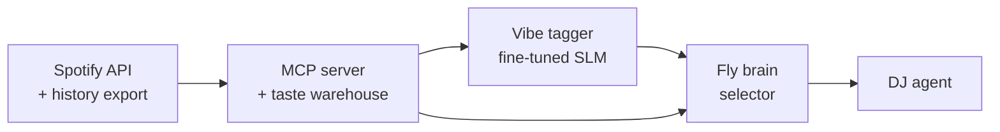
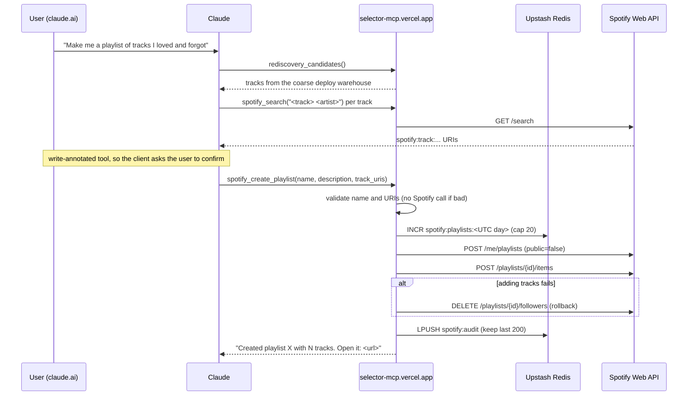

# Selector: presentation flow

Outline for a ~25 minute talk plus Q&A. Each section lists the slides, what to say, and roughly how long it takes. Section 5, the create-playlist flow, is the centrepiece. It walks through a real run end to end, with every tool call and its result: the playlist playing in the background of this talk.

| # | Section | Time |
| --- | --- | --- |
| 1 | Hook | 2 min |
| 2 | The constraint | 2 min |
| 3 | Architecture: four layers | 4 min |
| 4 | The fly, without the neuron talk | 3 min |
| 5 | **Create-playlist flow, with a real example** | 9 min |
| 6 | Results and honest limits | 3 min |
| 7 | How it was built (AI workflow) | 2 min |
| 8 | Live demo and Q&A | rest |

**Background music:** start [Selector DJ · Focus Drift · Oct 02](https://open.spotify.com/playlist/1esWpx1fxXo7MIWsJhZgnt) (30.5 min) quietly before slide 1. It's the playlist built in section 5, so the payoff line there is "you've been listening to it this whole time."

---

## 1. Hook (2 min)

**Slide 1.1: Title.** "Selector: a personal taste engine, and the DJ is a fly."

**Slide 1.2: Play `docs/media/watch.gif`** (or open selector-demo.vercel.app/watch). A track is hashed into a sparse fingerprint, the next track gets picked, you press *skip it*, and the synapses visibly weaken.

- One sentence: "This picks my next song using the wiring diagram of a real fruit fly's smell circuit, then learns from my skips."
- Promise for the talk: by the end you'll see how the music playing right now was chosen, and every decision behind every track.

## 2. The constraint (2 min)

**Slide 2.1: What Spotify took away (Nov 2024).** Table from the README: audio features, recommendations, related artists and preview URLs are gone for new apps. Search, library, top items and playlist create/edit survived.

**Slide 2.2: What's left to build with.**
- The GDPR Extended Streaming History export: 46,202 plays, 19,386 tracks, 2022 to 2026.
- Public catalog audio: iTunes Search API first, Deezer as the fallback. 86.4% of the library matched, reject-over-guess at a 0.72 threshold.
- Point to make: every recommendation tutorial broke overnight, so the features have to be derived from scratch.

## 3. Architecture: four layers (4 min)

**Slide 3.1: The diagram.**



**Slide 3.2: One line per layer.**
1. **Warehouse + MCP server.** DuckDB over the export, `ip_addr` dropped. Exposed to Claude as tools ("what did I binge in March and then abandon?").
2. **Vibe tagger.** *Measured* features (librosa, Essentia) vs *predicted* ones (Qwen3-0.6B + LoRA, distilled from Claude labels on 3,492 tracks, run on a consumer AMD GPU).
3. **The fly.** FlyWire connectome as a locality-sensitive hash, plus the mushroom body's learning rule trained on skips.
4. **DJ agent.** Brief → Arc → Select → Critique → Commit.

**Slide 3.3: Layer 1, a real question.** Run against the local warehouse on Oct 2, 2026:

```
→ binged_then_abandoned()
```
```
| artist                | spike_month | spike_plays | followup_plays |
| flipturn              | 2024-03     | 80          | 1              |
| Rebelution            | 2026-03     | 50          | 1              |
| The Weeknd            | 2025-02     | 46          | 0              |
| Red Hot Chili Peppers | 2024-02     | 43          | 1              |
| Todd Masten           | 2025-10     | 37          | 0              |
| ... 47 artists in total
```

**Slide 3.4: Measured vs predicted vs learned.** The key design rule, and it sets up section 5: hard constraints (the energy arc) only ever check *measured* audio. A model's guess at energy would make the constraint check nothing.

## 4. The fly, without the neuron talk (3 min)

**Slide 4.1: Input vector → sparse fingerprint.** 24 features per track → 344 projection neurons → 2,597 Kenyon cells → about 5% fire. Songs whose fingerprints land close together sound alike.

**Slide 4.1b: Real neighbours.** Track 3 of the background playlist, run Oct 2:

```
→ more_like_this("Trickling Sand", k=5)
```
```
| northen lights   | LVTA              | 6  |
| last light       | ddc.              | 8  |
| Ronda            | Christian Löffler | 8  |
| waltz of the end | Ngyn              | 10 |
| Traces           | Oskar Hahn        | 10 |
```

- Crate median is ~186, under 120 counts as a neighbour. Two pairs tie, and the tool says the fly can't tell tied tracks apart.

**Slide 4.2: What's not generic.** The projection isn't learned and isn't random. It's the fly's real wiring, 12,398 weighted connections from FlyWire.

**Slide 4.3: Taste = learning.** Dopamine-gated plasticity: a skip is punishment, a play-out is reward. That's what the "taste" score in section 5 comes from. Real call: `fly_score("High Tide, Storm Rising")` → `fly valence = 64.104 (approach)`. That track wins slot 6 in section 5, even though it's only been played once: the score comes from the fingerprint.

- Keep it short. If the room is technical, show `docs/img/fly_vs_lsh.png` (FlyHash 0.086 mAP vs 0.017 for random-projection LSH at 4 bits on MNIST).

---

## 5. The create-playlist flow (9 min)

There are two ways a playlist gets written to Spotify, and they're deliberately different.

| | Path A: "Ask Claude" (hosted) | Path B: DJ agent (local or hosted) |
| --- | --- | --- |
| Entry point | claude.ai → `https://selector-mcp.vercel.app/mcp` | `dj_set(...)` on either MCP server, or `scripts/dj_cron.py --commit` |
| Who picks the tracks | Claude, using warehouse + search tools | The five-stage DJ pipeline, with the fly brain |
| Write function | `spotify_tools.spotify_create_playlist` | `dj/commit.py` → `SpotifyClient.create_playlist` locally, `guarded_create_playlist` hosted |
| Safety | Input checks, 20/day cap, rollback, audit log, write annotation | `dry_run=True` by default, plus the critique must pass. Hosted runs also get every Path A guard. |
| Code | `src/selector/mcp/spotify_tools.py:338` | `src/selector/dj/commit.py:159`, `src/selector/mcp/dj_tools.py:159` |

Present Path B as the main story (it's the interesting one) and Path A as the "and you can also just ask for one from your phone" follow-up.

### 5.1 Path B overview slide

```
Brief ──► Arc ──► Select ──► Critique ──pass──► Commit ──► Spotify
                    ▲            │
                    └──reject────┘   (once)
```

- Every stage returns plain data, and the whole chain is logged to `data/dj_runs/<timestamp>-<theme>.json` with liner notes beside it as `.md`. That log is what the next slides are built from: **nothing below is a mock-up.**

### 5.2 Real example: "create a playlist for the background of this talk"

Run on Thu Oct 2 2026 at 07:56, in Claude Code against the local `selector` MCP server. Every tool call and result below is copied from that session (long results trimmed with `...`). Logs: `data/dj_runs/20261002-075629-focus-drift.json` (dry run) and `data/dj_runs/20261002-075637-focus-drift.json` (commit).

**Slide 5.2a: The prompt.**

> I want to present this project, create a playlist for the background.

There's no `make_background_playlist` tool. Claude has to turn a vague human request into tool calls, and the next slides show each one.

**Slide 5.2b: Step 1. Orient on the data.** The server's instructions say to call this first.

```
→ warehouse_summary()
```
```
| earliest_play       | latest_play         | total_plays | unique_tracks | unique_artists | total_hours |
| 2022-08-12 15:48:56 | 2026-09-15 18:16:00 | 43741       | 19386         | 6422           | 1,894.312   |
```

- Four years, 19k tracks, almost 1,900 hours. The export stops on Sep 15, so anything newer has to come from live Spotify.
- If asked why 43,741 and not 46,202: the export has 46,202 records, but 2,461 are podcast/audiobook rows with no track URI, which `load_history.py` drops.

**Slide 5.2c: Step 2. What's in rotation right now?** Live Spotify, because the export is two weeks stale.

```
→ spotify_recently_played(limit=10)
```
```
| name          | artist         | uri                                  | played_at            |
| Windowpane    | Mild High Club | spotify:track:0SfIHS5x1gOCVVvnYFbw26 | 2026-10-02T12:52:39Z |
| Daybreak      | Sven Wunder    | spotify:track:79e63Zozy0OPu6l48rO2Uh | 2026-10-02T12:48:44Z |
| A Little While| Yellow Days    | spotify:track:1ahzHj4rfljE8w4ZwpEjOM | 2026-10-02T12:40:00Z |
| Solar         | BALTHVS        | spotify:track:05kGcH9f3qzj9It2ZqeRsq | 2026-10-01T01:57:55Z |
| Sun & Moon    | BALTHVS        | spotify:track:3X41M8FCQJCuBWwIeKFQ3Q | 2026-09-30T21:38:38Z |
| ...           |                |                                      |                      |
```

**Slide 5.2d: Step 3. Claude's decision (no tool call).** The judgment step between the human's words and the tool's parameters:
- "Background for a talk" means steady, low-drama, and nothing that grabs attention from the speaker. That's the `focus drift` theme ("Daytime concentration: steady, low-drama, nothing that grabs the wheel", energy 0.20 to 0.55).
- The talk runs about 25 minutes, so `minutes=30`.
- **Dry run first.** Nothing gets written until the set has been seen.

Talking point: the theme had to be passed explicitly. At 07:56 the brief's own scoring would have picked "slow sunrise" (1.783) over "focus drift" (0.731). The clock knows it's morning, but it doesn't know you're about to give a talk.

**Slide 5.2e: Step 4. Dry run.**

```
→ dj_set(theme="focus drift", minutes=30, dry_run=True)
```
```
## Critique chain
- First pass: Pass: 9 tracks, 30.5 min, every track inside the +/-0.15 band,
  no jarring transitions, peak lifts 0.17 above the edges.

# Selector DJ · Focus Drift · Oct 02
Brief. Theme "focus drift" was requested. Recent rotation leans on BALTHVS,
       Five and Tens, Lords of Lounge, mostly chill, nostalgic.
Arc.   31 minutes, opener -> build -> peak -> comedown, energy 0.20-0.55.
...
1. Midnight Rendezvous - Spective `0:00` · opener · 108 BPM · energy 0.27
...
Dry run - nothing was written to Spotify. Re-run with dry_run=False to create it.
Full chain logged to data/dj_runs/20261002-075629-focus-drift.json
```

That one tool call runs all five stages. The next four slides open the log to show what each stage decided.

**Slide 5.2f: Inside the call. Brief** (`dj/brief.py`).

| Field | Value |
| --- | --- |
| `recent_source` | `spotify_live` (it falls back to the warehouse if no token is cached) |
| `recent_artists` | BALTHVS 12, Five and Tens 4, Lords of Lounge 3, Mild High Club 2, Yellow Days 2 |
| `recent_moods` | chill 0.46, nostalgic 0.20, playful 0.17, romantic 0.07 |
| `seed_track_ids` | 4 BALTHVS tracks from step 2 (Sun & Moon, Eternal Flow, Anouk, Mango Season) + 1 more |
| `theme_scores` | slow sunrise 1.783, **focus drift 0.731**, after hours 0.548, golden hour 0.313, ... |

- The seeds are the songs from step 2, so the set starts close to what you've actually been listening to.

**Slide 5.2g: Inside the call. Arc + Critique** (`dj/arc.py`, `dj/critique.py`). Target energy vs the *measured* energy of what got picked. Make this a line chart, with the target curve as a line and the picks as dots:

| # | Track | Phase | Target | Measured |
| --- | --- | --- | --- | --- |
| 1 | Midnight Rendezvous - Spective | opener | 0.27 | 0.27 |
| 2 | Curtain Drops - Erwin Do | opener | 0.27 | 0.29 |
| 3 | Trickling Sand - Yalisco | build | 0.33 | 0.33 |
| 4 | All Alone (Saint Ezekial guitar) - Oddisee | build | 0.39 | 0.38 |
| 5 | Nightshade - Robohands | build | 0.45 | 0.44 |
| 6 | High Tide, Storm Rising - Skinshape | peak | 0.53 | 0.50 |
| 7 | All Day, All Night (feat. Lydia Kitto) - Leon Bridges | peak | 0.53 | 0.57 |
| 8 | Glass Top Suite - Rum Jungle | comedown | 0.50 | 0.51 |
| 9 | Sierra - George Bloomfield | comedown | 0.33 | 0.37 |

- Hard rule: each track within ±0.15 of the target at the moment its midpoint plays. The worst miss here is 0.04.
- Critique also checks jarring transitions (energy step > 0.25, octave-folded tempo shift > 24%), the peak actually lifting, length ±15%, and max 2 tracks per artist. This set passed on the first try. Section 5.3 shows a rejection.

**Slide 5.2h: Inside the call. Select, one decision up close** (`dj/select.py`). Slot 6, 14:34 in, the start of the peak. Target energy 0.53, wants a *familiar* track. 179 tracks passed the hard filters. The top five:

| Candidate | Energy | BPM | Arc fit | Coherence (fly) | Taste | Theme | Transition penalty | **Total** |
| --- | --- | --- | --- | --- | --- | --- | --- | --- |
| **High Tide, Storm Rising** - Skinshape | 0.50 | 59 | 0.79 | 0.97 | 0.98 | 0.67 | 0.12 | **0.816** |
| All Day, All Night - Leon Bridges | 0.57 | 118 | 0.74 | 0.97 | 0.98 | 0.67 | 0.26 | 0.784 |
| Midnight Cowboy - Kraak & Smaak | 0.46 | 112 | 0.76 | 0.89 | 0.95 | 0.67 | 0.22 | 0.770 |
| Black Suede - Ever Age | 0.52 | 118 | 0.93 | 0.79 | 0.93 | 0.50 | 0.15 | 0.742 |
| Phantasmagoria - Orpheus | 0.55 | 136 | 0.91 | 0.99 | 0.98 | 0.67 | 0.87 | 0.740 |

- Skinshape wins because 59 BPM is exactly half of the previous track's 118, so after octave folding it's the same pulse and the transition penalty is tiny.
- Leon Bridges comes second here and wins the next slot.
- Black Suede and Phantasmagoria fit the arc best but lose anyway. Black Suede is weaker on theme (0.50) and fly coherence (0.79). Phantasmagoria's 136 BPM after 118 costs it a transition penalty of 0.87.
- Weights: theme 0.30, arc 0.25, coherence 0.25, taste 0.20, transition −0.15. Taste sits below theme on purpose: at equal weight the fly's favourite few dozen tracks won every slot of every theme.
- Familiar vs fresh alternates to hit `familiar_ratio=0.6`. "Fresh" slots draw from ~4,850 eligible tracks not played in 90 days, "familiar" ones from ~180.

**Slide 5.2i: Step 5. Commit.** The set looked right, and the user had asked for a playlist, so:

```
→ dj_set(theme="focus drift", minutes=30, dry_run=False)
```
```
## Critique chain
- First pass: Pass: 9 tracks, 30.5 min, ...
...
Created playlist: https://open.spotify.com/playlist/1esWpx1fxXo7MIWsJhZgnt
Full chain logged to data/dj_runs/20261002-075637-focus-drift.json
```

- Same inputs, same set: the DJ is deterministic, so the dry run is an honest preview of what gets written.
- The write is gated twice: `dry_run` must be off **and** the critique must have passed. Under the hood, `commit.py` → `SpotifyClient` makes two calls:

```
POST /me/playlists
  {"name": "Selector DJ · Focus Drift · Oct 02",
   "description": "Daytime concentration: steady, low-drama, nothing that grabs the wheel.
                   Picked with a fruit fly's olfactory circuit, wired from the FlyWire connectome, ...",
   "public": false}
→ id = 1esWpx1fxXo7MIWsJhZgnt

POST /playlists/1esWpx1fxXo7MIWsJhZgnt/items
  {"uris": ["spotify:track:6ZwSTT8AEXFBfKLrekha2L", "spotify:track:1EBigt4X9QblHy0fqunJ0C",
            "spotify:track:3FN8RroswLbQoaJ23U2UCw", "spotify:track:3Rsk6foioI8H4Bu36geEtF",
            "spotify:track:2kUmuc6TMXnF4Ft2tRP5SW", "spotify:track:7fPFaBCwqQqHEXsLLGtFmZ",
            "spotify:track:3bzPIGOvMnnePP7GzZrwF2", "spotify:track:0hezaqzgKy1AwkHgaycji7",
            "spotify:track:5S2YsA9pR6CjnNgryj9j6J"]}      # chunked at 100 per call
```

**Slide 5.2j: The liner notes** (the payoff slide). Every transition cites measured numbers and the fly's view:

> 4. **All Alone (Saint Ezekial guitar)** - Oddisee `9:05` · build · 118 BPM · energy 0.38
>    Tempo drops 123 -> 118 BPM while energy lifts 0.33 -> 0.38. Fly-brain neighbour of the last track (Hamming 16); fly taste score in the top 1% of the crate; in current rotation.
>
> 6. **High Tide, Storm Rising** - Skinshape `14:34` · peak · 59 BPM · energy 0.50
>    59 BPM runs at half time against 118 while energy lifts 0.44 -> 0.50, into the peak. Fly-brain neighbour of the last track (Hamming 82); fly taste score in the top 2% of the crate; in current rotation.
>
> 9. **Sierra** - George Bloomfield `27:10` · comedown · 118 BPM · energy 0.37
>    Tempo locks in at ~118 BPM while energy eases 0.51 -> 0.37. Fly-brain neighbour of the last track (Hamming 90); fly taste score in the top 1% of the crate; in current rotation.

- Hamming 16 between Oddisee and the track before it (Trickling Sand) is very close: the crate median is ~186, and under 120 counts as a fly-brain neighbour.
- "Back from the vault" means not played in the last 90 days, a rediscovery rather than an unheard track.
- Close on: "And that's what's been playing behind me since slide one."

**Backup if asked "does it scale?":** a 60-minute run on Sep 28 (`data/dj_runs/20260928-092457-focus-drift.md`, 16 tracks, 58.9 min, committed) passed critique the same way.

### 5.3 Real example of the critique loop: "Adrenaline", Wed Sep 24, 19:43

Source: `data/dj_runs/20260924-194335-adrenaline.json` (a dry run, `revised: true`).

**Slide 5.3: Reject → revise → pass.**

| Attempt | Slots 8 → 9 | Verdict |
| --- | --- | --- |
| 1 | Opendoors (Jitwam, 112 BPM, energy 0.96) → **C'est La Vie** (Common Saints, 112 BPM, energy 0.65) | **Reject: 1 jarring.** "energy jump of 0.31" |
| 2 | Let's Go (Khalid, 108 BPM, energy 0.89) → People Everywhere (Still Alive) (Khruangbin, 108 BPM, energy 0.65) | **Pass:** 9 tracks, 29.6 min, peak lifts 0.33 |

- What changed between attempts: the incoming side of the jarring transition (C'est La Vie) was excluded, transitions became a hard filter, and the transition weight doubled from 0.15 to 0.30.
- Exactly one revision. If attempt 2 had also failed, the run still returns its notes but Commit refuses to write.
- Across seven tuning contexts, 4 of 7 first passes were rejected and all 7 passed after one revision.

### 5.4 Path A: "Ask Claude" on the hosted server

The hosted server (`api/index.py` on Vercel) runs the DJ too. The fly brain can't be trained there, since there's no scipy and no per-play history, so the crate is built locally and uploaded with each track's fingerprint and taste score already computed. Same crate, same recent plays, same clock: same set. Path A is for requests the DJ doesn't cover, where Claude composes the playlist itself from the warehouse and search tools. Both paths end in the same guarded write below.

Talking point for the "how did you get the fly onto a serverless function?" question: the DJ only needs the fly's *output*, not the fly. Tags became plain integer arrays with a numpy Hamming distance, and six test runs on the full 16,700-track crate came out byte-identical before and after.

**Slide 5.4a: The sequence.**



**Slide 5.4b: The guardrails, one per line.**
- Login: MCP OAuth with Spotify as the identity provider, and only the owner's Spotify ID can get a token.
- No `public` parameter on the hosted tool, so the schema can't even offer it.
- Name 1 to 100 chars, max 500 tracks, every URI must match `spotify:track:<22 chars>`. Checked before Spotify is called.
- 20 playlists per UTC day, counted with Redis `INCR`.
- Create, then add. If the add fails, the empty playlist is deleted again.
- Description gets " · made with Selector" appended, and every creation goes to an audit list.
- Kill switches: `SELECTOR_REMOTE_SPOTIFY=off`, or delete the `spotify:token` Redis key.

**Slide 5.4c: Example prompts for the live demo, with real answers.** The read-only half of each prompt was run against the local warehouse on Oct 2 (no playlist created). The hosted server uses the coarser deploy warehouse, so its numbers may differ slightly.
- "What did I binge in March and then abandon? Make a playlist of the top 10." → `binged_then_abandoned()`, March rows: flipturn (Mar 2024, 80 → 1), Rebelution (Mar 2026, 50 → 1), kidstrange (Mar 2026, 31 → 0), aku.mu (Mar 2026, 20 → 0), The Velvet Underground (Mar 2024, 20 → 0).
- "Find 15 tracks I used to play a lot but haven't in 6 months and put them in a playlist called *Back From the Vault*." → `rediscovery_candidates(min_past_plays=25)`, 63 tracks: Something in the Orange - Zach Bryan (88 plays, last Apr 2025), Cold - Chris Stapleton (65, Nov 2024), Washington Lilacs - Zach Bryan (65, Mar 2024), You Should Probably Leave - Chris Stapleton (63, Feb 2025), ...
- Before the talk, `uv run python scripts/check_mcp_deploy.py --write` proves the write path works end to end. It creates a one-track playlist through the hosted server and deletes it again.

### 5.5 War stories from the playlist path (pick one or two)

- **Spotify's Feb 2026 migration** removed `/users/{id}/playlists` for Development Mode apps. It returned a bare 403 regardless of scope. The fix was `/me/playlists` and `/playlists/{id}/items` (`spotify/client.py:146`).
- **"Private" isn't private.** `public: false` keeps the playlist off the profile, but the Spotify app still lists it as Public until you pick "Make private" in the app. The Web API can't change that (`docs/OAUTH_NOTES.md`).
- **Two separate tokens.** The hosted server has its own Spotify login, stored Fernet-encrypted in Redis. A PKCE refresh can rotate the refresh token, so sharing one with the local machine would let either side break the other.

---

## 6. Results and honest limits (3 min)

**Slide 6.1: Results table** (from the README).
- Vibe tagger: lyrics + audio + metadata beats lyrics + metadata by 22% on intensity error (0.094 → 0.073).
- Audio match: 86.4% of 19,386 tracks.
- FlyHash vs classical LSH on MNIST: reproduces the paper at 4 bits. Real FlyWire wiring falls behind from 8 bits on.
- Skip prediction on never-heard tracks: 0.562 to 0.571 ROC-AUC vs 0.509 baseline. Modest, reported as measured.

**Slide 6.2: Limits worth saying out loud.**
- Every audio feature comes from a 30-second clip. A quiet intro or a late drop is invisible to the arc.
- Fingerprints still collide: 40.4% of tracks share an exact fingerprint with another.
- Same context + same recent plays = same set. Variety comes from listening changing, not randomness. (Section 5.2 used that on purpose: the dry run previewed exactly what got committed.)
- Themes and their energy ranges are hand-written, and the clock-based brief doesn't know your context. It picked "slow sunrise" for a morning talk until told otherwise.
- **Real example of the fly being wrong.** `skip_offenders(min_plays=20)` puts "A Day In The Life" (The Beatles) on top: 27 plays, skipped 63%, net verdict −3 (`track_detail`). `fly_score` still says +40.6, approach. The mushroom body scores fingerprints, and this one is shared with tracks that get played out. That's what lets it score unheard tracks at all, and also why it can miss one track's own history.

## 7. How it was built (2 min)

**Slide 7.1: The workflow.**
1. Write the project plan yourself, then argue with an Opus-class model until it holds up.
2. Have that model turn it into a prompt pack, one scoped prompt per session.
3. A cheaper model executes each prompt against the plan.
4. Review every diff by hand.

**Slide 7.2: What AI didn't do.** Choose what was worth building, decide when a result was honest enough to report, or notice that fingerprint collisions were a real limitation. The reverted `lyrics_status` feature (cost 0.05 AUC on unseen tracks) is the example to cite.

## 8. Live demo and Q&A

Demo order, safest first:
1. **selector-demo.vercel.app/watch**: press *skip it*, show the synapses weaken and the pick change. No login needed.
2. **Re-run the section 5.2 prompt live** in Claude Code with the `selector` MCP server, but stop at the dry run. The set will differ from this morning's if recent plays changed, which is a good talking point.
3. **CLI equivalent** if Claude Code isn't handy: `uv run python scripts/dj_cron.py --theme "focus drift" --minutes 30` (dry run), then `--commit`.
4. **(If the network cooperates)** Path A on claude.ai with one of the prompts from 5.4c. Confirm the write when the client asks.

Backup if anything fails: the background playlist from 5.2 already exists, and both run logs are on disk.

Likely questions to prep for:
- "Is the fly actually better than a normal embedding?" → Section 6 numbers. Honest answer: ties the idealised circuit at 4 bits, behind classical LSH by 64 bits. The point is the mechanism, not a SOTA claim.
- "Why not just use Spotify's recommendations?" → Section 2. They're gone for new apps.
- "Can other people use it?" → The web demo, yes, client-side on their own export. The hosted MCP server is single-user by design.
- "Is this a fly brain doing tasks?" → No. A connectome is a wiring diagram, not a trained brain. One circuit used as a hash, plus one learning rule.
